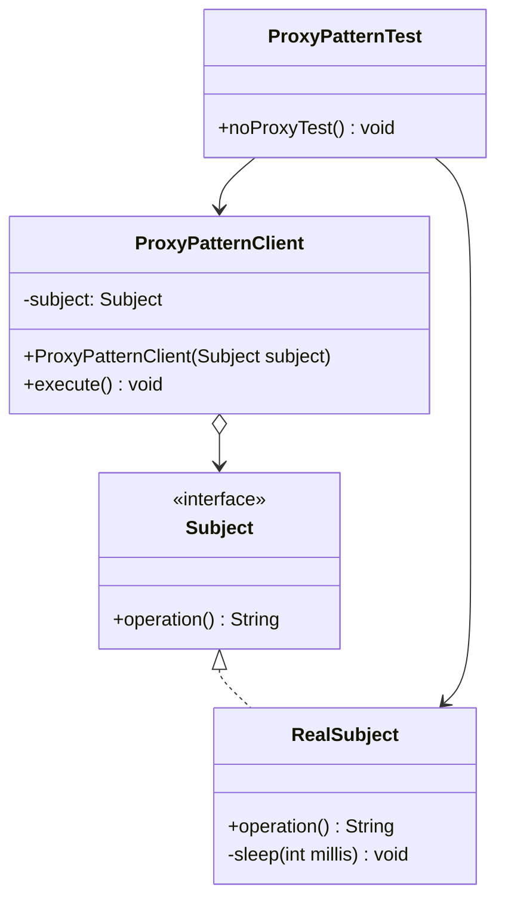
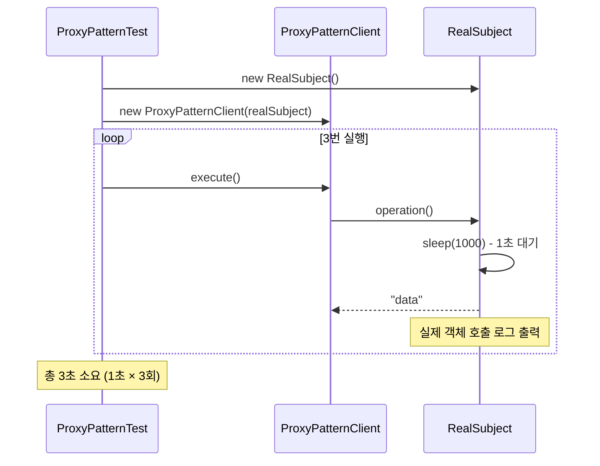
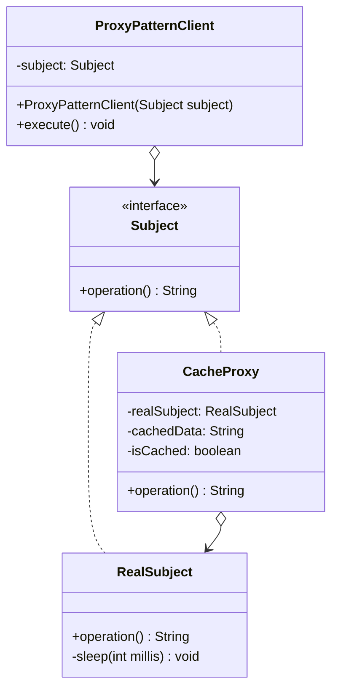
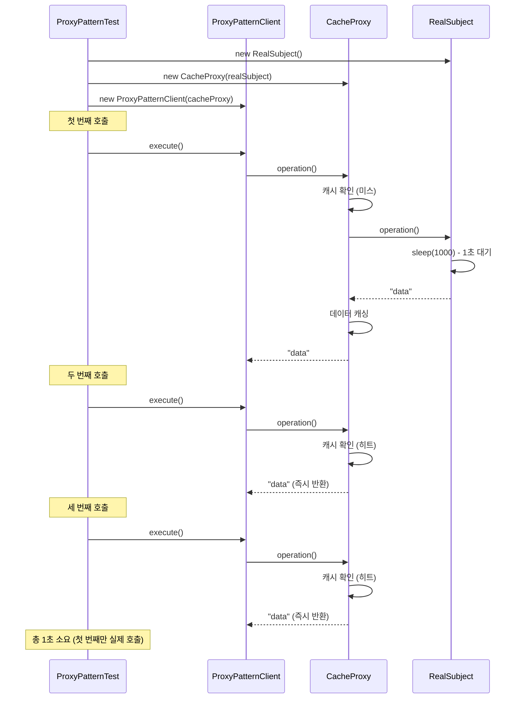

# 프록시 패턴 (Proxy Pattern) - 실제 코드 분석

## 개요

프록시 패턴은 다른 객체에 대한 접근을 제어하기 위해 대리자(proxy) 역할을 하는 객체를 제공하는 구조적 디자인 패턴입니다. 제공된 소스코드는 기본적인 프록시 패턴의 구조를 보여주며, `RealSubject`에 직접 접근하는 대신 프록시를 통해 접근할 수 있도록 설계되어 있습니다.

## 현재 코드 구조 분석

### 클래스 다이어그램



### 현재 코드의 시퀀스 다이어그램 (프록시 없는 경우)



## 제공된 소스코드 분석

### 1. Subject 인터페이스

```java
package com.choongang.proxy.pureproxy.proxy.code;

public interface Subject {
    String operation();
}
```

**역할**: RealSubject와 Proxy가 공통으로 구현할 인터페이스를 정의합니다.

### 2. RealSubject 클래스

```java
package com.choongang.proxy.pureproxy.proxy.code;

import lombok.extern.slf4j.Slf4j;

@Slf4j
public class RealSubject implements Subject {
    @Override
    public String operation() {
        log.info("실제 객체 호출");
        sleep(1000);    // 데이터 조회 시뮬레이션을 위해 1초 대기
        return "data";
    }

    private void sleep(int millis) {
        try {
            Thread.sleep(millis);
        } catch (InterruptedException e) {
            e.printStackTrace();
        }
    }
}
```

**특징**:
- 실제 비즈니스 로직을 수행하는 클래스
- `operation()` 메서드에서 1초의 지연시간으로 무거운 작업을 시뮬레이션
- 호출될 때마다 "실제 객체 호출" 로그를 출력

### 3. ProxyPatternClient 클래스

```java
package com.choongang.proxy.pureproxy.proxy.code;

/**
 * Subject 인터페이스에 의존하고, Subject 를 호출하는 클라이언트 코드이다
 * execute() 를 실행하면 subject.operation() 를 호출한다.
 */
public class ProxyPatternClient {

    private Subject subject;

    public ProxyPatternClient(Subject subject) {
        this.subject = subject;
    }

    public void execute() {
        String result = subject.operation();
    }
}
```

**특징**:
- Subject 인터페이스에 의존하므로 RealSubject나 Proxy 모두 사용 가능
- 의존성 주입을 통해 유연한 구조 제공
- `execute()` 메서드에서 `subject.operation()` 호출

### 4. ProxyPatternTest 클래스

```java
package com.choongang.proxy.pureproxy.proxy;

import com.choongang.proxy.pureproxy.proxy.code.ProxyPatternClient;
import com.choongang.proxy.pureproxy.proxy.code.RealSubject;
import org.junit.jupiter.api.Test;

public class ProxyPatternTest {

    @Test
    void noProxyTest() {
        // Client
        RealSubject realSubject = new RealSubject();
        ProxyPatternClient client = new ProxyPatternClient(realSubject);
        client.execute();       // 결과: 실제 객체 호출
        client.execute();
        client.execute();       // 3번 호출 = 총 3초 소요
    }
}
```

**현재 동작**:
- RealSubject를 직접 사용하여 3번 호출
- 각 호출마다 1초씩 소요되어 총 3초 필요
- 프록시 없이 직접 접근하는 방식

## 프록시 패턴 적용 제안

현재 코드에는 프록시가 구현되어 있지 않습니다. 다음과 같은 프록시들을 추가할 수 있습니다:

### 1. 캐싱 프록시 구현



```java
package com.choongang.proxy.pureproxy.proxy.code;

import lombok.extern.slf4j.Slf4j;

@Slf4j
public class CacheProxy implements Subject {
    
    private RealSubject realSubject;
    private String cachedData;
    private boolean isCached = false;
    
    public CacheProxy(RealSubject realSubject) {
        this.realSubject = realSubject;
    }
    
    @Override
    public String operation() {
        log.info("프록시 호출");
        
        if (!isCached) {
            log.info("캐시 미스 - 실제 객체 호출");
            cachedData = realSubject.operation();
            isCached = true;
        } else {
            log.info("캐시 히트 - 캐시된 데이터 반환");
        }
        
        return cachedData;
    }
}
```

### 2. 프록시 적용 후 시퀀스 다이어그램



### 3. 완전한 프록시 테스트 코드

```java
package com.choongang.proxy.pureproxy.proxy;

import com.choongang.proxy.pureproxy.proxy.code.*;
import org.junit.jupiter.api.Test;
import org.junit.jupiter.api.DisplayName;

public class ProxyPatternTest {

    @Test
    @DisplayName("프록시 없이 직접 호출 - 3초 소요")
    void noProxyTest() {
        RealSubject realSubject = new RealSubject();
        ProxyPatternClient client = new ProxyPatternClient(realSubject);
        
        long startTime = System.currentTimeMillis();
        
        client.execute();       // 1초 소요
        client.execute();       // 1초 소요
        client.execute();       // 1초 소요
        
        long endTime = System.currentTimeMillis();
        System.out.println("총 소요 시간: " + (endTime - startTime) + "ms");
        // 예상 결과: 약 3000ms
    }
    
    @Test
    @DisplayName("캐싱 프록시 사용 - 1초 소요")
    void cacheProxyTest() {
        RealSubject realSubject = new RealSubject();
        CacheProxy cacheProxy = new CacheProxy(realSubject);
        ProxyPatternClient client = new ProxyPatternClient(cacheProxy);
        
        long startTime = System.currentTimeMillis();
        
        client.execute();       // 1초 소요 (실제 호출)
        client.execute();       // 즉시 반환 (캐시)
        client.execute();       // 즉시 반환 (캐시)
        
        long endTime = System.currentTimeMillis();
        System.out.println("총 소요 시간: " + (endTime - startTime) + "ms");
        // 예상 결과: 약 1000ms
    }
}
```

## 프록시 패턴의 장점 (현재 코드 기준)

### 1. 성능 향상
- **문제**: RealSubject의 `operation()`이 1초씩 소요되어 3번 호출 시 3초 필요
- **해결**: 캐싱 프록시로 첫 번째 호출 후 결과를 저장하여 총 1초로 단축

### 2. 투명성
- ProxyPatternClient는 Subject 인터페이스에만 의존
- RealSubject든 Proxy든 동일하게 사용 가능
- 클라이언트 코드 변경 없이 프록시 적용 가능

### 3. 제어 가능성
- 실제 객체 접근을 프록시가 제어
- 로깅, 인증, 캐싱 등 부가 기능 추가 가능

## 추가 프록시 유형 제안

### 1. 로깅 프록시

```java
@Slf4j
public class LoggingProxy implements Subject {
    private RealSubject realSubject;
    
    public LoggingProxy(RealSubject realSubject) {
        this.realSubject = realSubject;
    }
    
    @Override
    public String operation() {
        log.info("메서드 호출 시작");
        long startTime = System.currentTimeMillis();
        
        String result = realSubject.operation();
        
        long endTime = System.currentTimeMillis();
        log.info("메서드 호출 완료 - 소요시간: {}ms", (endTime - startTime));
        
        return result;
    }
}
```

### 2. 지연 로딩 프록시

```java
@Slf4j
public class LazyLoadingProxy implements Subject {
    private RealSubject realSubject;
    
    @Override
    public String operation() {
        log.info("지연 로딩 프록시 호출");
        
        if (realSubject == null) {
            log.info("RealSubject 인스턴스 생성");
            realSubject = new RealSubject();
        }
        
        return realSubject.operation();
    }
}
```

## 결론

현재 제공된 코드는 프록시 패턴을 적용하기 위한 기본 구조를 잘 갖추고 있습니다:

1. **Subject 인터페이스**: 공통 계약 정의
2. **RealSubject**: 실제 비즈니스 로직 구현 
3. **ProxyPatternClient**: 인터페이스에 의존하는 클라이언트
4. **ProxyPatternTest**: 동작 검증을 위한 테스트

프록시를 추가하면 성능 최적화, 로깅, 보안 등의 부가 기능을 클라이언트 코드 변경 없이 투명하게 제공할 수 있습니다. 특히 현재 코드에서는 캐싱 프록시를 적용하면 실행 시간을 3초에서 1초로 크게 단축할 수 있습니다.