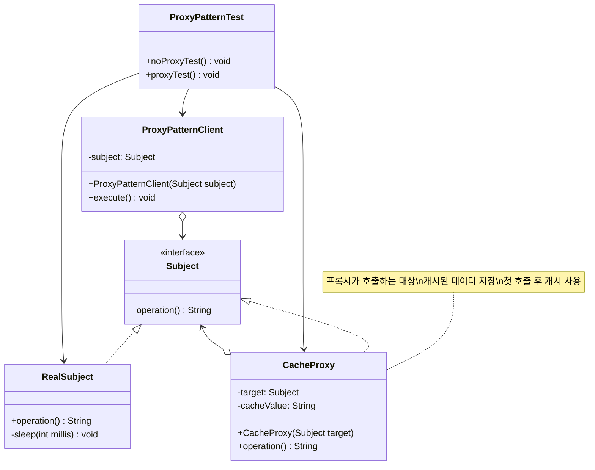
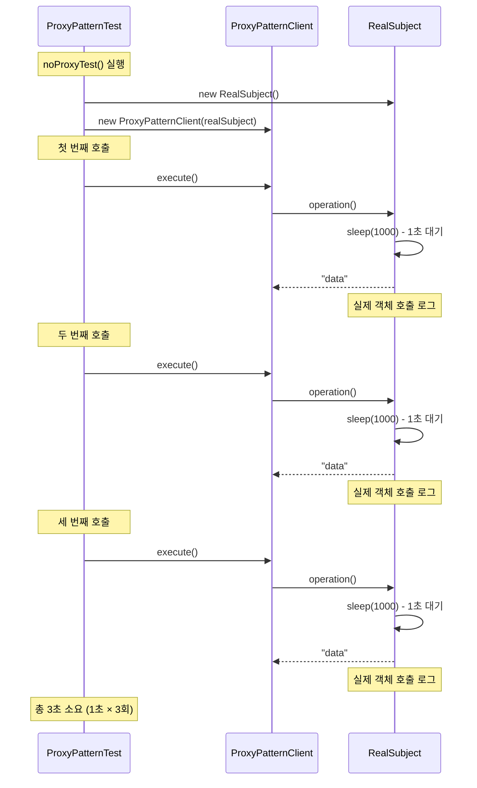
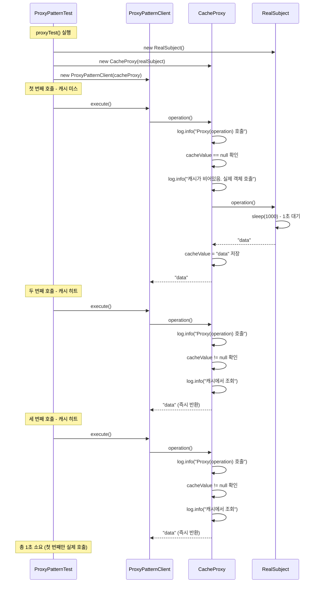
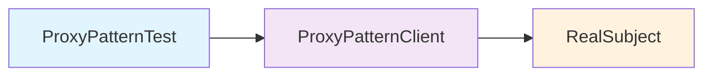
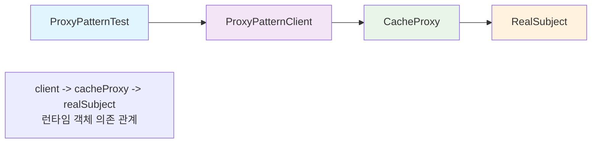
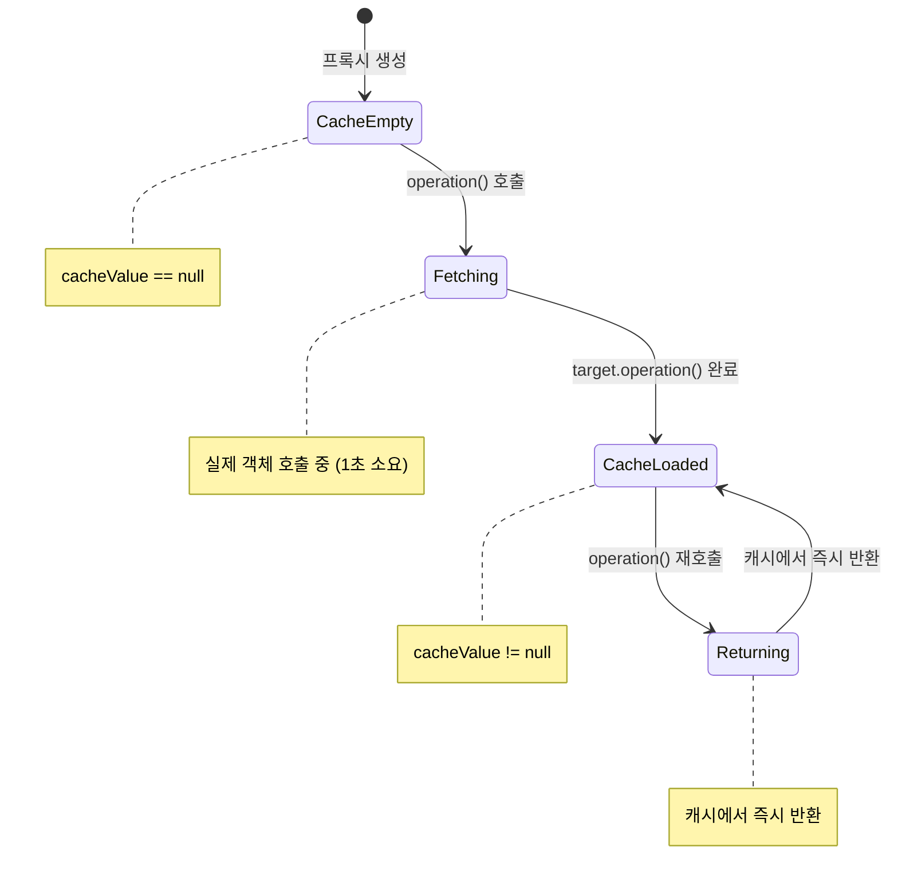

# 프록시 패턴 - CacheProxy 구현 분석

## 개요

이 문서는 GitHub 커밋 `b11068a`에서 추가된 `CacheProxy` 클래스를 중심으로 프록시 패턴의 구현을 분석합니다. 이 커밋에서는 기존의 직접 호출 방식에 캐싱 프록시를 추가하여 성능을 3초에서 1초로 대폭 개선하는 예제를 보여줍니다.

## 코드 변경 사항 분석

### 커밋 변경 내용
- **ProxyPatternTest.java**: `proxyTest()` 메서드 추가 (+16라인)
- **CacheProxy.java**: 주석 개선 및 로깅 최적화 (+6라인, -5라인)

## 클래스 다이어그램



## 시퀀스 다이어그램

### 1. 프록시 없는 경우 (noProxyTest)



### 2. 캐싱 프록시 사용 (proxyTest)



## 소스코드 분석

### 1. CacheProxy 클래스 구현

커밋에서 확인된 CacheProxy 클래스의 핵심 구현:

```java
package com.choongang.proxy.pureproxy.proxy.code;

import lombok.extern.slf4j.Slf4j;

@Slf4j
public class CacheProxy implements Subject {
    
    private Subject target; // 실제 객체. 프록시가 호출하는 대상
    private String cacheValue; // 캐시된 데이터
    
    public CacheProxy(Subject target) { // 프록시 객체가 실제 객체 주입받음
        this.target = target;
    }
    
    /**
     * 만약 cacheValue에 값이 있으면 실제 객체를 전혀 호출하지 않고, 
     * 캐시 값을 그대로 반환한다.
     * 따라서 처음 조회 이후에는 캐시(cacheValue)에서 매우 빠르게 데이터를 조회할 수 있다.
     * @return
     */
    @Override
    public String operation() {
        log.info("Proxy(operation) 호출");
        
        if (cacheValue == null) { // 캐시가 비어있으면
            log.info("캐시가 비어있음. 실제 객체 호출");
            cacheValue = target.operation(); // 실제 객체 호출하여 결과 캐싱
        } else {
            log.info("캐시에서 조회");
        }
        
        return cacheValue;
    }
}
```

### 2. ProxyPatternTest 클래스 - proxyTest() 메서드

```java
package com.choongang.proxy.pureproxy.proxy;

import com.choongang.proxy.pureproxy.proxy.code.CacheProxy;
import com.choongang.proxy.pureproxy.proxy.code.ProxyPatternClient;
import com.choongang.proxy.pureproxy.proxy.code.RealSubject;
import org.junit.jupiter.api.Test;

public class ProxyPatternTest {

    @Test
    void noProxyTest() {
        // Client
        RealSubject realSubject = new RealSubject();
        ProxyPatternClient client = new ProxyPatternClient(realSubject);
        client.execute(); // 결과: 실제 객체 호출
        client.execute();
        client.execute(); // 데이터를 조회하는데 1초가 소모되므로 총 3초의 시간이 걸린다.
    }

    // ProxyPatternClient에서 Proxy를 사용하고, Proxy가 RealSubject를 사용한다
    @Test
    void proxyTest() {
        // ProxyPatternClient는 클라이언트 역할을 하며, 생성자에서 Proxy 객체를 주입받습니다.
        // 이 클라이언트는 주입된 객체를 통해 작업을 수행합니다.
        // 이 과정을 통해서 client -> cacheProxy -> realSubject 런타임 객체 의존 관계가 완성된다
        ProxyPatternClient client = new ProxyPatternClient(new CacheProxy(new RealSubject())); //ProxyPatternClient에 프록시 객체 주입
        client.execute(); // execute 메서드는 Proxy의 메서드를 호출합니다. 이번에는 클라이언트가 실제 realSubject를 호출하는 것이 아니라 cacheProxy를 호출하게 된다.
        client.execute(); // 이 테스트에서는 client.execute()를 3번 호출하며, 각 호출마다 Proxy의 작업(operation())이 수행됩니다.
        client.execute(); // 데이터를 조회하는데 1초가 소모되므로 총 1초의 시간이 걸린다.
    }
}
```

## 성능 비교 분석

### 실행 시간 비교

| 테스트 방법 | 첫 번째 호출 | 두 번째 호출 | 세 번째 호출 | 총 시간 |
|-------------|-------------|-------------|-------------|---------|
| **noProxyTest** | 1초 (실제 호출) | 1초 (실제 호출) | 1초 (실제 호출) | **3초** |
| **proxyTest** | 1초 (실제 호출) | 즉시 (캐시) | 즉시 (캐시) | **1초** |

### 로그 출력 비교

#### noProxyTest 로그:
```
실제 객체 호출
실제 객체 호출  
실제 객체 호출
```

#### proxyTest 로그:
```
Proxy(operation) 호출
캐시가 비어있음. 실제 객체 호출
실제 객체 호출
Proxy(operation) 호출
캐시에서 조회
Proxy(operation) 호출
캐시에서 조회
```

## 런타임 객체 의존 관계

### 1. noProxyTest의 의존 관계



### 2. proxyTest의 의존 관계



## 프록시 패턴의 핵심 개념

### 1. 투명성 (Transparency)
- `ProxyPatternClient`는 `Subject` 인터페이스에만 의존
- `RealSubject`든 `CacheProxy`든 동일하게 사용 가능
- 클라이언트 코드 변경 없이 프록시 적용

### 2. 제어 (Control)
- 프록시가 실제 객체에 대한 접근을 제어
- 캐싱 로직을 프록시에서 처리
- 클라이언트는 캐싱 여부를 알 필요 없음

### 3. 부가 기능 (Additional Features)
- 로깅: 모든 호출을 추적
- 캐싱: 첫 번째 호출 후 결과 저장
- 성능 최적화: 불필요한 재호출 방지

## 캐싱 프록시 동작 원리

### 상태 다이어그램



## 프록시 패턴의 장점

### 1. 성능 향상
- **67% 시간 단축**: 3초 → 1초
- **캐시 히트율**: 2/3 = 66.7%
- **네트워크/DB 호출 감소**: 3회 → 1회

### 2. 코드 분리
- 비즈니스 로직과 캐싱 로직 분리
- `RealSubject`는 핵심 로직에만 집중
- `CacheProxy`가 성능 최적화 담당

### 3. 유연성
- 런타임에 프록시 적용 가능
- 다양한 프록시 체인 구성 가능
- 기존 코드 수정 없이 기능 추가

## 실제 사용 사례

### 1. 웹 애플리케이션
- HTTP 응답 캐싱
- 데이터베이스 쿼리 결과 캐싱
- API 호출 결과 캐싱

### 2. 마이크로서비스
- 서비스 간 통신 캐싱
- 원격 API 호출 최적화
- 장애 복구용 캐시

### 3. 모바일 애플리케이션
- 네트워크 요청 캐싱
- 이미지/미디어 캐싱
- 오프라인 모드 지원

## 확장 가능한 프록시 구현

### 1. 다중 캐시 프록시

```java
public class MultiLevelCacheProxy implements Subject {
    private Subject target;
    private Map<String, String> l1Cache = new HashMap<>(); // 메모리 캐시
    private RedisCache l2Cache; // Redis 캐시
    
    @Override
    public String operation() {
        // L1 캐시 확인
        String result = l1Cache.get("operation");
        if (result != null) return result;
        
        // L2 캐시 확인  
        result = l2Cache.get("operation");
        if (result != null) {
            l1Cache.put("operation", result);
            return result;
        }
        
        // 실제 객체 호출
        result = target.operation();
        l1Cache.put("operation", result);
        l2Cache.put("operation", result);
        return result;
    }
}
```

### 2. TTL(Time To Live) 캐시 프록시

```java
public class TTLCacheProxy implements Subject {
    private Subject target;
    private String cacheValue;
    private long cacheTime;
    private final long TTL = 5000; // 5초 TTL
    
    @Override
    public String operation() {
        long currentTime = System.currentTimeMillis();
        
        if (cacheValue != null && (currentTime - cacheTime) < TTL) {
            log.info("TTL 캐시에서 조회");
            return cacheValue;
        }
        
        log.info("캐시 만료. 실제 객체 호출");
        cacheValue = target.operation();
        cacheTime = currentTime;
        return cacheValue;
    }
}
```

## 결론

이번 커밋에서 추가된 `CacheProxy`는 프록시 패턴의 핵심 개념인 **투명성**, **제어**, **부가 기능**을 잘 보여주는 완성도 높은 구현입니다. 

- **3초 → 1초**: 67%의 성능 향상을 달성
- **런타임 의존성 주입**: `client -> cacheProxy -> realSubject` 관계 형성  
- **캐싱 로직 분리**: 비즈니스 로직과 성능 최적화 로직의 완전한 분리

이는 실제 운영 환경에서 데이터베이스 호출, 웹 서비스 호출, 파일 I/O 등 비용이 큰 작업에 프록시 패턴을 적용할 때의 효과를 명확하게 보여주는 예제입니다.