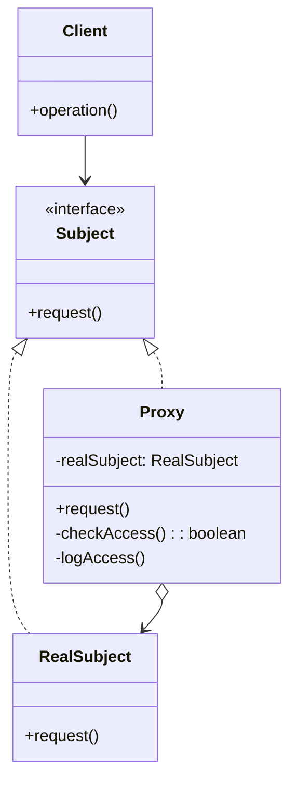
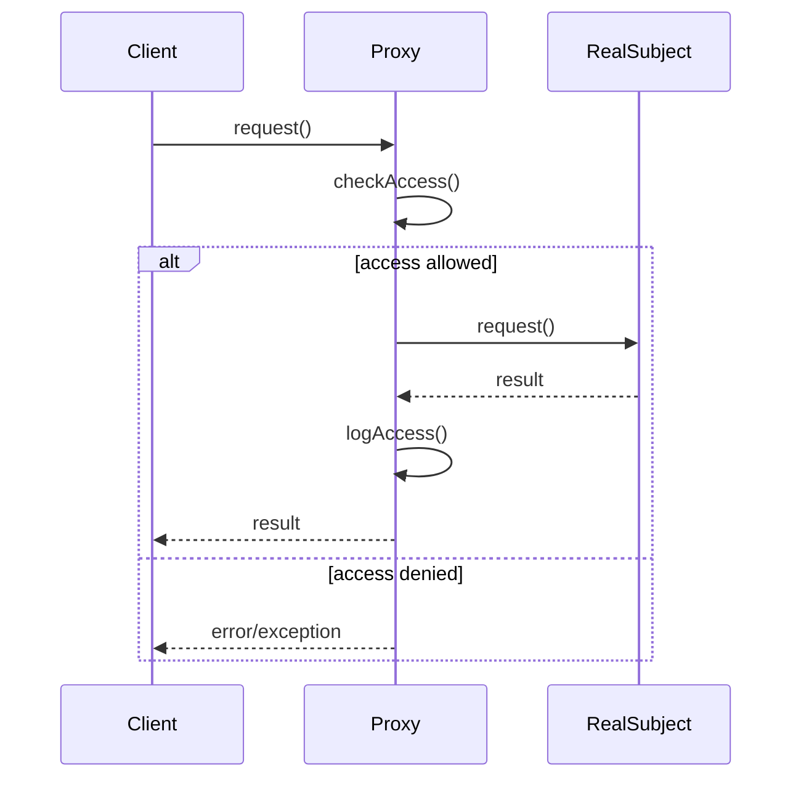

# 프록시 패턴 (Proxy Pattern)

## 개요

프록시 패턴은 다른 객체에 대한 접근을 제어하기 위해 대리자(proxy) 또는 자리표시자(placeholder)를 제공하는 구조적 디자인 패턴입니다. 클라이언트가 실제 객체에 직접 접근하는 대신 프록시 객체를 통해 간접적으로 접근하게 함으로써, 추가적인 기능을 투명하게 제공할 수 있습니다.

## 주요 특징

- **접근 제어**: 실제 객체에 대한 접근을 제한하거나 조건부로 허용
- **지연 로딩**: 실제로 필요할 때까지 무거운 객체의 생성을 지연
- **캐싱**: 결과를 캐시하여 성능 향상
- **로깅 및 모니터링**: 메서드 호출을 기록하고 추적
- **원격 접근**: 원격 객체에 대한 로컬 대표자 역할

## 구조

### 클래스 다이어그램



### 시퀀스 다이어그램



## 구성 요소

### Subject (주체)
- RealSubject와 Proxy가 공통으로 구현하는 인터페이스
- 클라이언트가 RealSubject와 Proxy를 동일하게 다룰 수 있게 함

### RealSubject (실제 주체)
- 실제 작업을 수행하는 객체
- Proxy가 대리하는 실제 객체

### Proxy (프록시)
- RealSubject에 대한 참조를 유지
- Subject와 동일한 인터페이스를 구현
- RealSubject에 대한 접근을 제어하고 추가 기능을 제공

## 프록시 패턴의 종류

### 1. 가상 프록시 (Virtual Proxy)
무거운 객체의 생성을 실제로 필요할 때까지 지연시킵니다.

```java
public class ImageProxy implements Image {
    private String filename;
    private RealImage realImage;
    
    public ImageProxy(String filename) {
        this.filename = filename;
    }
    
    @Override
    public void display() {
        if (realImage == null) {
            realImage = new RealImage(filename); // 지연 로딩
        }
        realImage.display();
    }
}
```

### 2. 보호 프록시 (Protection Proxy)
객체에 대한 접근을 제어합니다.

```java
public class DocumentProxy implements Document {
    private RealDocument realDocument;
    private String userRole;
    
    public DocumentProxy(String filename, String userRole) {
        this.realDocument = new RealDocument(filename);
        this.userRole = userRole;
    }
    
    @Override
    public void display() {
        realDocument.display();
    }
    
    @Override
    public void edit() {
        if ("ADMIN".equals(userRole)) {
            realDocument.edit();
        } else {
            throw new SecurityException("편집 권한이 없습니다.");
        }
    }
}
```

### 3. 원격 프록시 (Remote Proxy)
원격 객체에 대한 로컬 대표자 역할을 합니다.

```java
public class RemoteServiceProxy implements Service {
    private String serverUrl;
    private HttpClient httpClient;
    
    public RemoteServiceProxy(String serverUrl) {
        this.serverUrl = serverUrl;
        this.httpClient = new HttpClient();
    }
    
    @Override
    public String getData(String id) {
        // HTTP 요청을 통해 원격 서버에서 데이터 조회
        return httpClient.get(serverUrl + "/data/" + id);
    }
}
```

### 4. 캐싱 프록시 (Caching Proxy)
결과를 캐시하여 성능을 향상시킵니다.

```java
public class CachingProxy implements DataService {
    private RealDataService realService;
    private Map<String, Object> cache;
    
    public CachingProxy() {
        this.realService = new RealDataService();
        this.cache = new HashMap<>();
    }
    
    @Override
    public Object getData(String key) {
        if (cache.containsKey(key)) {
            System.out.println("캐시에서 데이터 반환: " + key);
            return cache.get(key);
        }
        
        Object data = realService.getData(key);
        cache.put(key, data);
        return data;
    }
}
```

## 실제 사용 예시

### JavaScript에서의 프록시 패턴

```javascript
// ES6 Proxy를 사용한 예시
class DatabaseService {
    getData(id) {
        console.log(`데이터베이스에서 ${id} 조회 중...`);
        return `데이터 ${id}`;
    }
}

const createCachingProxy = (target) => {
    const cache = new Map();
    
    return new Proxy(target, {
        get(obj, prop) {
            if (prop === 'getData') {
                return function(id) {
                    if (cache.has(id)) {
                        console.log(`캐시에서 반환: ${id}`);
                        return cache.get(id);
                    }
                    
                    const result = obj[prop].call(obj, id);
                    cache.set(id, result);
                    return result;
                };
            }
            return obj[prop];
        }
    });
};

// 사용 예시
const dbService = new DatabaseService();
const cachedService = createCachingProxy(dbService);

cachedService.getData('user1'); // 데이터베이스에서 조회
cachedService.getData('user1'); // 캐시에서 반환
```

### Python에서의 프록시 패턴

```python
from abc import ABC, abstractmethod
import time

class Subject(ABC):
    @abstractmethod
    def request(self):
        pass

class RealSubject(Subject):
    def request(self):
        print("RealSubject: 요청 처리 중...")
        time.sleep(2)  # 무거운 작업 시뮬레이션
        return "처리 완료"

class LoggingProxy(Subject):
    def __init__(self, real_subject):
        self._real_subject = real_subject
        
    def request(self):
        print("LoggingProxy: 요청 로깅")
        start_time = time.time()
        
        result = self._real_subject.request()
        
        end_time = time.time()
        print(f"LoggingProxy: 처리 시간 {end_time - start_time:.2f}초")
        
        return result

# 사용 예시
real_subject = RealSubject()
proxy = LoggingProxy(real_subject)
proxy.request()
```

## 장점

1. **투명성**: 클라이언트는 프록시를 사용하는지 실제 객체를 사용하는지 알 필요가 없음
2. **성능 향상**: 지연 로딩, 캐싱 등을 통해 성능을 개선할 수 있음
3. **접근 제어**: 보안이나 권한 관리를 쉽게 구현할 수 있음
4. **추가 기능**: 로깅, 모니터링 등의 부가 기능을 쉽게 추가할 수 있음
5. **개방-폐쇄 원칙**: 기존 코드를 수정하지 않고 새로운 기능을 추가할 수 있음

## 단점

1. **복잡성 증가**: 새로운 클래스가 추가되어 시스템이 복잡해질 수 있음
2. **성능 오버헤드**: 추가적인 간접 참조로 인한 성능 저하 가능성
3. **응답 지연**: 프록시의 추가 처리로 인한 지연 발생 가능

## 다른 패턴과의 비교

### 데코레이터 패턴과의 차이점

| 특징 | 프록시 패턴 | 데코레이터 패턴 |
|------|-------------|-----------------|
| 목적 | 접근 제어 | 기능 확장 |
| 객체 생성 | 프록시가 실제 객체 생성 관리 | 클라이언트가 객체 생성 |
| 인터페이스 | 동일한 인터페이스 | 동일하거나 확장된 인터페이스 |

### 어댑터 패턴과의 차이점

| 특징 | 프록시 패턴 | 어댑터 패턴 |
|------|-------------|-------------|
| 목적 | 접근 제어 | 인터페이스 변환 |
| 인터페이스 | 동일한 인터페이스 | 다른 인터페이스 연결 |

## 실제 적용 사례

1. **웹 프록시 서버**: HTTP 요청을 캐싱하고 필터링
2. **ORM 프레임워크**: 지연 로딩으로 데이터베이스 접근 최적화
3. **보안 프록시**: API 호출에 대한 인증 및 권한 확인
4. **로깅 프록시**: 메서드 호출을 자동으로 로깅
5. **원격 서비스**: RPC, REST API 클라이언트

## 결론

프록시 패턴은 객체에 대한 접근을 제어하고 추가 기능을 제공하는 강력한 디자인 패턴입니다. 특히 성능 최적화, 보안, 로깅 등의 요구사항이 있을 때 매우 유용하며, 기존 코드를 수정하지 않고도 새로운 기능을 투명하게 추가할 수 있는 유연성을 제공합니다.