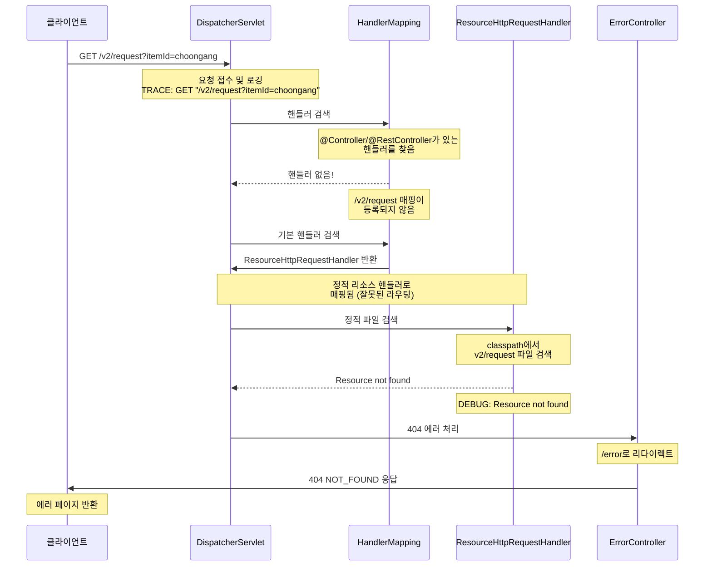
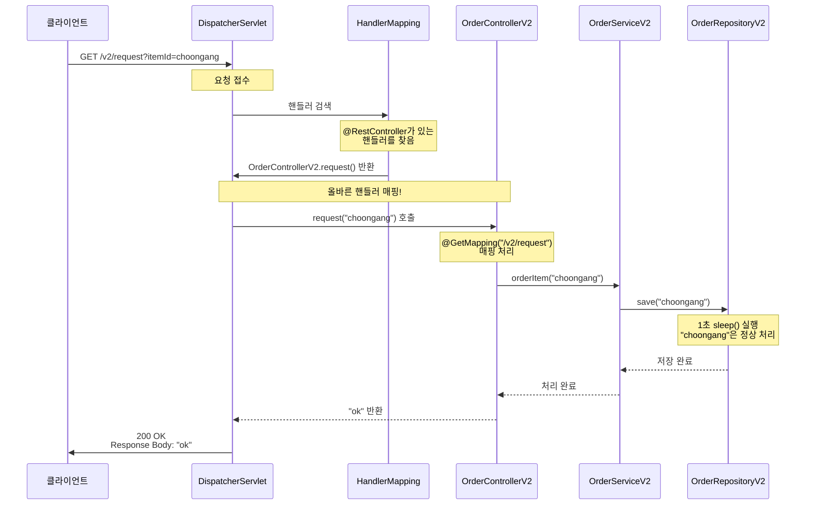

# Spring MVC 요청 처리 과정 분석

## 📋 요청 개요
- **URL**: `http://localhost:8080/v2/request?itemId=choongang`
- **Method**: GET
- **현재 상태**: 404 NOT_FOUND 에러 발생

## 🔄 현재 실행 과정 (문제 상황)



## ❌ 문제 원인 분석

### 1. Bean 등록 상태
```java
// AppV2Config.java - ✅ Bean으로 등록됨
@Configuration
public class AppV2Config {
    @Bean
    public OrderControllerV2 orderControllerV2() {
        return new OrderControllerV2(orderServiceV2());
    }
}
```

### 2. 컨트롤러 어노테이션 누락
```java
// OrderControllerV2.java - ❌ 컨트롤러 어노테이션 없음
@Slf4j
@RequestMapping    // 이것만으론 부족!
@ResponseBody      // 이것도 부족!
public class OrderControllerV2 {
    @GetMapping("/v2/request")  // 매핑이 등록되지 않음
    public String request(String itemId) {
        // ...
    }
}
```

### 3. Spring MVC 매핑 테이블 상태
```
현재 매핑 테이블:
┌─────────────────┬──────────────────┐
│ URL Pattern     │ Handler          │
├─────────────────┼──────────────────┤
│ /v2/request     │ (없음!)          │
│ /error          │ ErrorController  │
│ /**             │ ResourceHandler  │
└─────────────────┴──────────────────┘
```

## ✅ 해결 후 예상 실행 과정



## 🛠️ 해결 방법

### 1. 컨트롤러 어노테이션 추가
```java
@Slf4j
@RestController  // 👈 이 어노테이션 추가!
@RequestMapping
public class OrderControllerV2 {
    // 기존 코드 그대로...
}
```

### 2. 해결 후 매핑 테이블
```
해결 후 매핑 테이블:
┌─────────────────┬──────────────────────────┐
│ URL Pattern     │ Handler                  │
├─────────────────┼──────────────────────────┤
│ /v2/request     │ OrderControllerV2.request│ ✅
│ /error          │ ErrorController          │
│ /**             │ ResourceHandler          │
└─────────────────┴──────────────────────────┘
```

### 3. 애플리케이션 시작 시 확인할 로그
```
INFO : Mapped "{[/v2/request],methods=[GET]}" onto 
       public java.lang.String OrderControllerV2.request(String)
```

## 🔍 핵심 개념

### Bean 등록 vs 컨트롤러 등록
```
Bean 등록 (Spring Container)
    ↓
    객체 생성 및 의존성 주입
    ↓
    @Autowired 등으로 사용 가능

컨트롤러 등록 (Spring MVC)
    ↓
    @Controller/@RestController 스캔
    ↓
    @RequestMapping 등 분석
    ↓
    URL 매핑 테이블 생성
    ↓
    HTTP 요청 처리 가능
```

### 어노테이션의 역할
- **`@Bean`**: Spring 컨테이너에 객체 등록
- **`@Controller`**: Spring MVC에 컨트롤러로 등록
- **`@RestController`**: `@Controller` + `@ResponseBody`
- **`@RequestMapping`**: URL 매핑 정보 제공

## 📝 결론

현재 문제는 **Bean으로는 등록되어 있지만, Spring MVC 컨트롤러로는 등록되지 않은 상태**입니다. `@RestController` 어노테이션을 추가하면 Spring MVC가 해당 클래스를 컨트롤러로 인식하여 URL 매핑을 등록하게 됩니다.